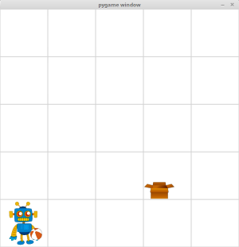

# Simple OpenAI Gym Environment

A simple 2D grid environment where a robot has the goal to put the ball in the box.
The agent can pick-up and put-down, the box or the ball, but can carry only one of the objects at one time.  

You can choose between a fixed: 'PutBallInBoxEnvFixed' (initial state selected randomly but the same, every episode) or randomly variable: 'PutBallInBoxEnvRandom' (initial state selected randomly in each episode). 

There are 4 sizes of the grid available:
- 3x3
- 5x5
- 8x8
- 20x20



## Installation

Clone this repository and install:
```
cd gym-simple
pip3 install -e .
```
Requirements:
- Python 3
- OpenAI Gym
- NumPy
- PyGame

## Basic Usage

Example of importing and using the environment making the agent do random actions.
```
import gym
import gym_simple

env = gym.make('PutBallInBoxEnvRandom5x5-v0')

n_episodes = 100
n_steps = 300

for i_episode in range(n_episodes):
    print("Episode " + str(i_episode + 1))
    observation,_,_,_ = env.reset()
    for t in range(n_steps):
        env.render()
        action = env.action_space.sample()
        observation, reward, done, info = env.step(action)
        if done:
            print("Reached the goal after {} timesteps".format(t+1))
            break
```
